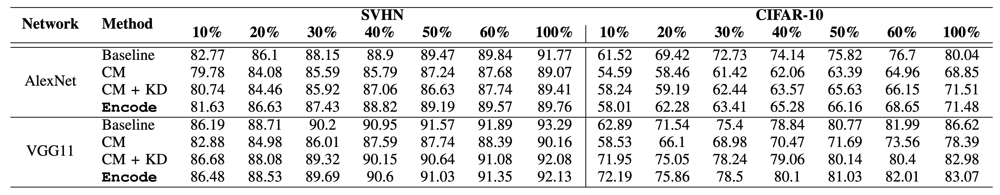
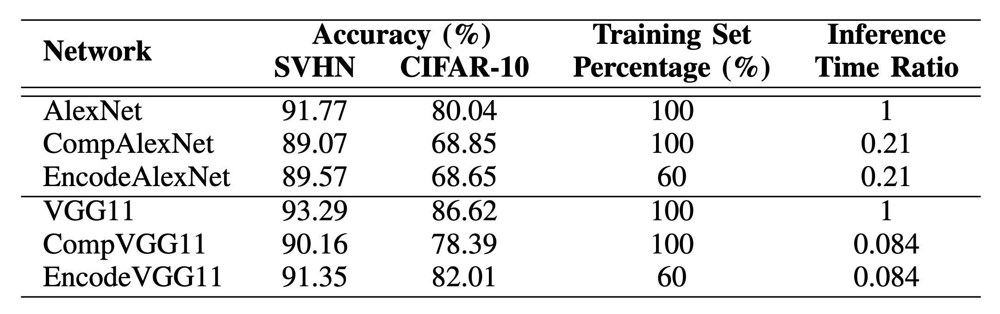
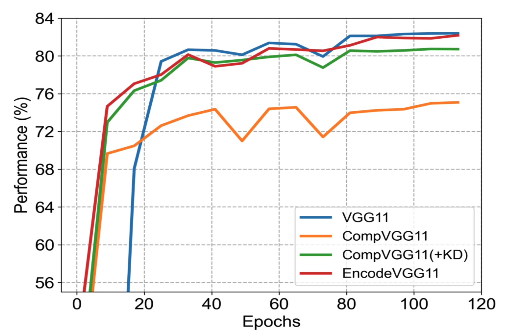

# [EnCoDe: Enhancing Compressed Deep Learning Models through Feature Distillation and Informative Sample Selection](https://doi.org/10.1109/ICMLA58977.2023.00093)


## Introduction
This repository contains the official PyTorch implementation of the paper "EnCoDe: Enhancing Compressed Deep Learning Models through Feature Distillation and Informative Sample Selection," presented at ICMLA 2023.

Authors: Rebati Gaire, Sepehr Tabrizchi, and Arman Roohi \
Affiliations: School of Computing, University of Nebraska-Lincoln, Lincoln, NE, USA.

EnCoDe merges active learning, model compression, and knowledge distillation to optimize deep learning models for edge devices. This technique addresses issues such as generalization loss, resource intensity, and data redundancy that often affect compressed models. EnCoDe's utility is validated using SVHN and CIFAR-10 datasets, demonstrating improved model compactness, enhanced generalization, reduced computational complexity, and reduced labeling efforts.

## Table of Contents
- [Introduction](#introduction)
- [Requirements](#requirements)
- [Installation](#installation)
- [Usage](#usage)
  - [Running Experiments](#running-experiments)
  - [Performance Comparison](#performance-comparison)
- [Citation](#citation)
- [License](#license)

## Requirements
- Python 3.8+
- PyTorch 1.8+
- NumPy
- Pandas
- SciPy
- Matplotlib

## Installation
1. Clone the repository:

    ```bash
    git clone https://github.com/yourusername/encode.git
    cd encode
    ```

2. Create a virtual environment and activate it:

    ```bash
    python -m venv venv
    source venv/bin/activate 
    ```

3. Install the required packages:

    ```bash
    pip install -r requirements.txt
    ```

## Usage

To run different experiments, navigate to the respective directories and execute the `main.py` script with the appropriate arguments. The available experiments are:

- `Single`: Runs the experiment with 100% labeled data.
- `Random`: Runs the model with different splits of labeled training data from 5% to 100%, with samples added randomly each time.
- `KD`: Uses knowledge distillation from the teacher model to the compact model with random selection of samples in the training set.
- `EnCoDe`: Incorporates active learning with a sampler network that selects the most informative and representative samples into the training set.

### Running Experiments

1. **Single Experiment:**
    ```bash
    cd AlexNet/CIFAR10/Single
    python main.py --expt single --num_images 50000 --num_val 5000  --lr_task 0.001
    ```

2. **Random Experiment:**
    ```bash
    cd AlexNet/CIFAR10/Random
    python main.py --expt random --num_images 50000 --num_val 5000 --budget 5000 --initial_budget 5000 --subset 10000  --lr_task 0.001
    ```

3. **KD Experiment:**
    ```bash
    cd AlexNet/CIFAR10/KD
    python main.py --expt kd ---num_images 50000 --num_val 5000 --budget 5000 --initial_budget 5000 --subset 10000  --lr_task 0.001
    ```

4. **EnCoDe Experiment:**
    ```bash
    cd AlexNet/CIFAR10/EnCoDe
    python main.py --expt encode --num_images 50000 --num_val 5000 --budget 5000 --initial_budget 5000 --subset 10000  --lr_task 0.001
    ```


#### Performance Comparison

**EnCoDe** performance on image classification task using SVHN and CIFAR-10 datasets compared to teacher model (baseline), compressed student model (CM), and compressed student model with knowledge distillation (CM+KD)




Performance comparison of the proposed **EnCoDe** approach with the teacher model and the compressed student model in terms of accuracy, percentage of training samples used for training, and the inference time on a single data sample.




The learning curve for the proposed **EnCoDe** framework compared to other baseline approaches at different training epochs while training with only 50% training samples.




For detailed results and analysis, please refer to the [paper](https://doi.org/10.1109/ICMLA58977.2023.00093).

## Citation

If you find this repository useful in your research, please cite our paper:

  ```bash
  @inproceedings{gaire2023encode,
  title={EnCoDe: Enhancing Compressed Deep Learning Models Through Feature---Distillation and Informative Sample Selection},
  author={Gaire, Rebati and Tabrizchi, Sepehr and Roohi, Arman},
  booktitle={2023 International Conference on Machine Learning and Applications (ICMLA)},
  pages={633--638},
  year={2023},
  organization={IEEE}
}
```

## Licence
This project is licensed under the MIT License - see the [LICENSE](LICENSE) file for details.